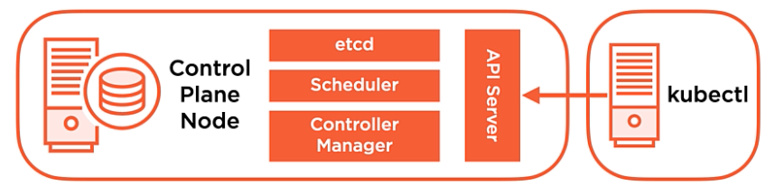

# CHAPTER 2<br>Exploring the Kubernetes Architecture

### Table of contents
  - Introduction, Course and Module Overview
  - What is Kubernetes? Kubernetes Benefits and Operating Principles
  - Introducing the Kubernetes API - Objects and API Server
  - Understanding API Objects - Pods
  - Understanding API Objects - Controllers
  - Understanding API Objects - Services
  - Understanding API Objects - Storage
  - Kubernetes Cluster Components Overview and Control Plane
  - Nodes
  - Cluster Add-on Pods
  - Pod Operations
  - Service Operations
  - Kubernetes Networking Dundamentals
  - Module summary and what is next

<br>

## Introduction, Course and Module Overview
- What is Kubernetes?
- Exploring Kubernetes Architecture
  - Cluster Components
  - Networking Fundamentals

<br><br><br>

## What is Kubernetes? Kubernetes Benefits and Operating Principles

At its core, Kubernetes is a **container orchestrator**. This means it is responsible for **starting and stopping container-based applications** according to the requirements set by system administrators or developers.

### Key Functions of Kubernetes
1. **Workload Placement**  
   Kubernetes determines **where** a container-based application should be deployed within a cluster. It considers factors like:
   - Which servers the application should run on.
   - Whether it needs to be co-located with other services or containers.
   - How to distribute workloads efficiently.
2. **Infrastructure Abstraction**  
   Developers can deploy applications without worrying about the **underlying infrastructure**. Kubernetes automatically:
   - Schedules workloads.
   - Configures load balancers.
   - Manages networking and storage.
3. **Desired State Management**  
   Kubernetes ensures that the system remains in its **desired state** as defined by the administrator or developer.  
   - Developers describe the **desired state** in configuration files.
   - Kubernetes continuously ensures the running state matches the desired state.
   - If a failure occurs (e.g., a crashed container), Kubernetes restores the system to the defined desired state.

### Benefits of Kubernetes
- **Fast Deployment**  
  Kubernetes enables rapid deployment of container-based applications, allowing:
  - Developers to push code changes to production quickly.
  - Fast iteration and release cycles.
- **Automated Recovery**  
  If a system deviates from its desired state (e.g., due to container failure or server crash), Kubernetes:
  - Detects the issue.
  - Deploys replacement containers automatically.
  - Restores the system to its correct state.
- **Hides Infrastructure Complexity**  
  Kubernetes abstracts away complex infrastructure tasks, handling:
  - **Storage** management.
  - **Networking** configuration.
  - **Workload placement** decisions.

### Core Operating Principles of Kubernetes
1. **Desired State & Declarative Configuration**  
   - Kubernetes uses a **declarative approach**, where administrators define the desired state of applications in configuration files.
   - Kubernetes then ensures that the system reaches and maintains this state.
2. **Controllers & Control Loops**  
   - **Controllers** are responsible for **monitoring** the system’s state and ensuring it remains in the desired state.
   - Example: If we specify **three web application containers**, the controller ensures that exactly three instances are running at all times.
   - If a container crashes, the controller automatically replaces it.
3. **Kubernetes API**  
   - The **Kubernetes API** provides objects for defining and managing systems programmatically.
   - The API is implemented through the **API Server**, which:
     - Acts as the central communication hub for all components in a Kubernetes cluster.
     - Enables administrators and developers to interact with Kubernetes for deployment and management.

By leveraging these principles, Kubernetes automates application deployment, scaling, and recovery, making it a powerful platform for containerized applications.


<br><br><br>


## Introducing the Kubernetes API - Objects and API Server
### API Objects and Their Role  
Kubernetes operates using a collection of **API objects**, which serve as the **primitives that define the system's state**. These objects include:

- **Pods** – Represent a deployed container or a collection of containers running as a unit.
- **Controllers** – Maintain the system in the **desired state** by managing workloads.
- **Services** – Provide a persistent access point to applications running in pods.
- **Storage Objects** – Enable persistent data storage for applications.

### Declarative vs. Imperative Approaches  
Kubernetes supports two ways of configuring system state:

1. **Declarative** – The desired system state is described in **YAML/JSON files**, and Kubernetes ensures that the system conforms to it.  
2. **Imperative** – The system is modified through direct **command-line execution** of `kubectl` commands.

### Kubernetes API Server  
The **API Server** is the central communication hub of a Kubernetes cluster. It operates as a **RESTful API over HTTP/HTTPS** using **JSON**, and:

- **Serves as the sole interface** for administrators and Kubernetes components to interact with the cluster.
- **Handles object creation and configuration changes**, serializing them and persisting them into the cluster’s datastore.

### Core Kubernetes API Objects  

#### **1. Pods**  
Pods represent the fundamental unit of deployment in Kubernetes. They can consist of a **single container** or multiple **co-located containers** that share networking and storage.

#### **2. Controllers**  
Controllers ensure that the cluster maintains the **desired state** of applications. Key controllers include:

- **ReplicaSets** – Ensure a specified number of identical pods are running.
- **Deployments** – Manage updates and rollbacks of application versions.

#### **3. Services**  
Since **Pods are ephemeral**, they can be created and destroyed dynamically. **Services** provide a stable access point to pods by:

- Load balancing traffic across pod replicas.
- Enabling **automatic discovery** of application endpoints.

#### **4. Storage**  
Kubernetes provides storage objects for persistent data needs. Storage can be:

- **Ephemeral** – Lost when the pod is deleted.
- **Persistent Volumes (PVs)** – Maintain data beyond the lifecycle of a pod.


<br><br><br>


## Understanding API Objects - Pods
### What is a Pod?  
A **pod** is the smallest deployable unit in Kubernetes, representing **one or more containers** running together as a unit. Each pod encapsulates:

- A **containerized application** or service.
- **Resource definitions** specifying CPU, memory, and storage requirements.
- **Networking configurations** for communication between containers and the cluster.

### Key Characteristics of Pods  
1. **Ephemerality**  
   - Pods are **not redeployed** if they fail. Instead, a new pod is created from the same container image.
   - No state is maintained between failed and newly created pods unless persistent storage is used.
2. **Atomicity**  
   - A **single-container pod** is either running or not.
   - A **multi-container pod** is considered unavailable if any of its containers fail.
3. **Scheduling**  
   - Kubernetes assigns pods to available **nodes** based on resource requirements and cluster capacity.
   - Pods are dynamically scheduled and relocated as needed.

### Maintaining Pod Health  
Kubernetes ensures that applications stay in their **desired state** using **controllers** and **health checks**.

- **State Tracking**  
  - Kubernetes monitors if a pod and its containers are running as expected.
- **Health Probes**  
  Kubernetes uses probes to check an application’s health inside a pod:
  - **Liveness Probe** – Checks if the application is still running.
  - **Readiness Probe** – Determines if the application is ready to accept traffic.
  - **Startup Probe** – Verifies that an application has started correctly.


#### Example: Defining a Liveness Probe in a Pod  
```yaml
apiVersion: v1
kind: Pod
metadata:
  name: my-app
spec:
  containers:
  - name: my-container
    image: my-app:latest
    livenessProbe:
      httpGet:
        path: /health
        port: 8080
      initialDelaySeconds: 3
      periodSeconds: 5
```

In this example:
- The **liveness probe** checks the `/health` endpoint every 5 seconds.
- If the probe fails, Kubernetes restarts the pod.

### Managing failures
When a **liveness probe** fails for the first time, Kubernetes does **not immediately** restart the pod. Instead, it follows these steps based on the probe configuration:  

1. **Failure Threshold & PeriodSeconds**  
   - The liveness probe runs at an interval defined by `periodSeconds` (e.g., every 5 seconds).  
   - Kubernetes only restarts the container if the probe fails **`failureThreshold` times in a row**.  
   - Example: If `failureThreshold: 3` and `periodSeconds: 5`, the container must fail **three consecutive times** (15 seconds total) before Kubernetes restarts it.
2. **Restart Policy**  
   - If a liveness probe fails the required number of times, Kubernetes **restarts the container** (not the entire pod).
   - The pod remains unchanged unless its **restart policy** is set to `Never` (default is `Always`).

### Example of Liveness Probe with Failure Handling  
```yaml
apiVersion: v1
kind: Pod
metadata:
  name: example-pod
spec:
  containers:
  - name: example-container
    image: my-app:latest
    livenessProbe:
      httpGet:
        path: /health
        port: 8080
      initialDelaySeconds: 5  # Wait 5 seconds before first check
      periodSeconds: 10       # Check every 10 seconds
      failureThreshold: 3     # Restart after 3 consecutive failures
```
### Breakdown:
- Kubernetes waits **5 seconds** (`initialDelaySeconds`) before running the first check.
- It checks every **10 seconds** (`periodSeconds`).
- If `/health` fails **3 times in a row**, Kubernetes restarts the container.

So, **a single failure does not trigger a restart**—it only happens after multiple consecutive failures as defined by `failureThreshold`.

> **Default Value of failureThreshold**
> If failureThreshold is not specified, Kubernetes defaults it to 3. This means that the liveness probe must fail 3 consecutive times before Kubernetes restarts the container.


<br><br><br>


## Understanding API Objects - Controllers

### What Are Controllers?
Controllers define the desired state for a Kubernetes cluster and the applications deployed in it. Their role is to ensure that applications remain in the desired state by monitoring and responding to changes in pod state and health.

Controllers are exposed as workload resource API objects and are responsible for creating and managing pod-based applications.

### How Controllers Maintain Desired State
- Controllers continuously monitor the state and health of deployed pods.
- They ensure the required number of pods remain up, running, and healthy.
- If a pod fails, the controller deletes the failed pod and deploys a new one to restore the desired state.

### ReplicaSets
A **ReplicaSet** ensures that a specified number of pod replicas are always running. If any pod in the ReplicaSet becomes unavailable, Kubernetes replaces it with a new one.

Example use case:
- If three web application pods are required, the ReplicaSet ensures three are always running.

### Deployments
A **Deployment** is a higher-level abstraction that manages ReplicaSets. Instead of manually creating ReplicaSets, users define a deployment, which then:
- Creates and manages ReplicaSets.
- Specifies the container image and number of pod replicas.
- Handles updates and rollbacks between application versions.

Example:
- A deployment can transition an application from version 1.1 to 1.2 while maintaining availability.
- Rollbacks are possible if the new version causes issues.

### Other Controllers
Kubernetes provides additional controllers for managing nodes, services, and other infrastructure components. These will be covered later.


<br><br><br>


## Understanding API Objects - Services
### **What Are Services in Kubernetes?**  
A **Service** in Kubernetes is a **network abstraction** that provides a **stable endpoint (IP and DNS) for a set of Pods**. Since Pods are ephemeral and can be recreated with different IPs, Services ensure **consistent access** to applications running in the cluster.  

### **How Do Services Work?**  
- Kubernetes assigns a **persistent IP address and DNS name** to the Service.  
- As Pods are created or terminated, Kubernetes **dynamically updates the Service** with the new set of healthy Pods.  
- Users or other applications access the **Service endpoint**, not the individual Pods.  
- Kubernetes **automatically routes traffic** to available, healthy Pods.  

### **Benefits of Services:**  
- **Persistency** → Ensures a stable network identity despite Pod restarts.  
- **Automatic Traffic Routing** → Directs requests to the right Pods.  
- **Load Balancing** → Distributes traffic across multiple Pods.  
- **Scaling Support** → Works with autoscaling by adjusting to new Pods.  

### **Types of Kubernetes Services**  
1. **ClusterIP (Default)**  
   - **Exposes** the service **internally within the cluster**.  
   - Not accessible from outside the cluster.  
   - Used for **internal communication** between microservices.  
   - Example use case: Backend database service for internal access.  
2. **NodePort**  
   - Exposes the service on a **static port** on each Node's IP.  
   - Accessible externally via `<NodeIP>:<NodePort>`.  
   - Used for **simple external access** (e.g., debugging or direct access).  
   - Example use case: Exposing a basic web service for testing.  
3. **LoadBalancer**  
   - Exposes the service via a **cloud provider's load balancer** (AWS, GCP, Azure).  
   - Provides a **public IP** that routes traffic to the Service.  
   - Used for **production-grade external access**.  
   - Example use case: Exposing a web application to the internet.  
4. **ExternalName**  
   - Maps a Service to an **external DNS name** instead of routing to Pods.  
   - Used to **redirect traffic to services outside the cluster**.  
   - Example use case: Connecting to an external database or API.  


<br><br><br>


## Understanding API Objects - Storage
Kubernetes provides multiple ways to manage data storage within a cluster. Initially, Kubernetes introduced **volumes**, which were directly attached to pods. However, this approach had limitations, leading to the development of **persistent volumes**.

### **1. Volumes**
- A **volume** is tied directly to a pod and its lifecycle.
- When a pod is deleted, the associated volume is also lost.
- This approach tightly couples storage with a specific pod, making it inflexible for dynamic storage needs.

### **2. Persistent Volumes (PV)**
- A **Persistent Volume (PV)** is a storage resource defined at the cluster level.
- Unlike traditional volumes, PVs exist independently of any single pod.
- Cluster administrators configure PVs, and they remain available for multiple pods.

### **3. Persistent Volume Claims (PVC)**
- Pods do not directly request storage from a PV.
- Instead, a pod makes a **Persistent Volume Claim (PVC)**, specifying the required storage size and type.
- Kubernetes then matches the PVC to an available PV, decoupling pod storage from the underlying infrastructure.

### **4. Key Benefits of Persistent Volumes**
- **Decoupling Storage from Pods:** Storage is independent of a pod's lifecycle, allowing better flexibility.
- **Persistence Across Pod Restarts:** Data remains available even if a pod is recreated.
- **Dynamic Storage Allocation:** Kubernetes can provision storage dynamically based on PVC requests.


<br><br><br>


## Kubernetes Cluster Components Overview and Control Plane

A Kubernetes cluster is composed of multiple components that work together to manage workloads efficiently. These components are categorized into **Control Plane Components** and **Worker Node Components**.

### **1. Control Plane Components(Master Node)**



The **Control Plane** is responsible for managing the cluster, scheduling workloads, and ensuring the desired state of the system.

- **API Server**
  - The **API Server** acts as the central communication hub for the cluster.
  - It exposes a **RESTful API** for cluster administration.
  - All changes to the cluster configuration pass through the API Server.
  - It validates requests and persists the state into the **etcd** database.
- **etcd (Cluster Store)**
  - A **key-value store** that maintains the cluster state.
  - Stores configuration data and metadata about all Kubernetes objects.
  - Provides high availability by supporting distributed storage.
- **Scheduler**
  - Watches the API Server for **unscheduled pods** and assigns them to nodes.
  - Evaluates **resource requirements** (CPU, memory, storage).
  - Respects **affinity and anti-affinity rules**, ensuring pods are placed optimally.
- **Controller Manager**
  - Runs **controller loops** to enforce the desired state of the cluster.
  - Manages the lifecycle of Kubernetes objects such as **pods and ReplicaSets**.
  - Ensures that the right number of pods are running based on configurations.
- 

### **2. Worker Node Components(Node)**
Worker nodes run application workloads and handle networking.
- **Nodes (Worker Nodes)**
  - Responsible for running **pods and containers**.
  - Ensure networking reachability between pods and services.
  - Can be **physical or virtual machines**.
- **Pod Scheduling**
  - Each node contributes compute resources to the cluster.
  - Pods are **scheduled based on resource availability**.

## **3. kubectl: The Kubernetes CLI**
- A command-line tool for interacting with the Kubernetes API Server.
- Used for **deploying workloads, retrieving information, and managing resources**.
- Commonly pronounced as `kubectl`, `kube control`, or `kube cuddle`.


<br><br><br>


## Nodes
A **node** in a Kubernetes cluster is where application **pods** run. It is responsible for starting up the pods, managing networking, and ensuring container execution. A cluster consists of multiple nodes based on the **scalability requirements** of the deployed applications.


### **1. Key Node Components**
Each node contains several core components that enable it to function efficiently.

- **kubelet**
  - The **kubelet** is responsible for managing pod lifecycle on the node.
  - It continuously monitors the **API Server** for new pod assignments.
  - Once a pod is scheduled to a node, the Kubelet starts the required containers.
  - It also reports **node and pod health** back to the API Server.
- **kube-proxy**
  - Manages **networking** for pods within a node.
  - Implements **service abstraction**, ensuring that services route traffic to the correct pods.
  - Typically configured using **IP tables** (though other modes exist).
  - Handles **load balancing** across multiple pods for incoming traffic.
- **Container Runtime**
  - Responsible for **downloading and running container images**.
  - Kubernetes supports multiple runtimes via the **Container Runtime Interface (CRI)**.
  - **Default runtime:** `containerd` (since Kubernetes v1.20).
  - Previous runtime: `Docker` (deprecated in v1.20, removed in v1.22).
  - Any **CRI-compliant** runtime can be used, allowing flexibility.


### **2. Node Components on the Control Plane**
- Even on **control plane nodes**, `kubelet`, `kube-proxy`, and the **container runtime** are present.
- Special-purpose control plane pods also run on these nodes, supporting cluster management.


### **3. Node Operations**
1. **Pod Scheduling**: The API Server assigns pods to nodes based on available resources.
2. **Networking & Load Balancing**: Kube-proxy routes and balances traffic between pods.
3. **Container Execution**: The container runtime pulls images and starts the required containers.
4. **Monitoring & Health Checks**: Kubelet continuously reports pod and node health.


<br><br><br>


## Cluster Add-on Pods
Cluster add-on pods provide specialized services to the Kubernetes cluster itself. These services enhance the functionality of the cluster and are often essential for networking, service discovery, and administration.

### CoreDNS
- CoreDNS is the default DNS server used in Kubernetes clusters.
- DNS service pods run inside the cluster and provide DNS resolution for internal services.
- The IP address of the CoreDNS service and the search domain suffix are automatically added to the networking configuration of all pods.
- Nodes, pods, and services register their addresses with the CoreDNS server upon creation.
- This DNS service is critical for **service discovery** within the cluster.

### Other Cluster Add-Ons
#### Ingress Controllers
- Act as advanced HTTP (Layer 7) load balancers and content routers.
- Allow external traffic to reach services inside the cluster based on routing rules.
- Not enabled by default but can be installed as an add-on.

#### Kubernetes Dashboard
- A web-based administration interface for managing the cluster.
- Provides an overview of resources and workloads.
- Optional and can be installed if needed.

#### Network Overlays
- Extend networking capabilities inside Kubernetes.
- Help manage cross-node communication in the cluster.
- More details on network overlays will be covered separately.

### Summary
- **CoreDNS** is an essential cluster add-on for service discovery.
- **Ingress controllers** and **the Kubernetes dashboard** are optional but useful for managing external traffic and administration.
- **Network overlays** play a role in enhancing Kubernetes networking.
