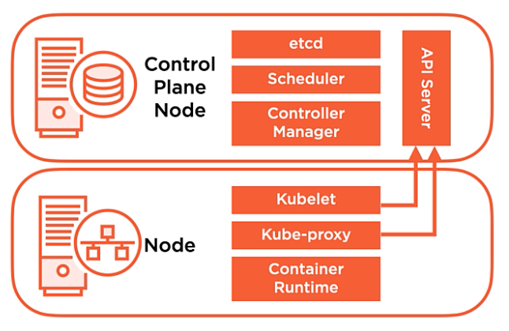

# Installing and Configuring Kubernetes

### Table of contents
  - Module Overview
  - Installation Considerations
  - Installation Methods
  - Installation Requirements
  - Understanding Cluster Networking Ports
  - Getting Kubernetes
  - Building your Own Cluster
  - Installing Kubernetes on VMs
  - Lab Environment Overview
  - `Demo`: Installing and configuring containerd
  - `Demo`: Installing and configuring Kubernetes Packages
  - Bootstrapping a Cluster with kubeadm
  - Understanding the Certificate Authority Role in your Cluster
  - kubeadm Created kubeconfig Files and Static Pod Manifests
  - Pod Networking Fundamentals
  - Creating a Cluster Control Plane Node and Adding a Node
  - `Demo`: Creating a Cluster Control Plane Node
  - `Demo`: Adding a Node to Your Cluster
  - Managed Cloud Deployment Scenarious: AKS, EKS, and GKE
  - `Demo`: Creating a Cluster in the Cloud with Azure Kubernetes Service
  - Module Summary and what is next

   

## Module Overview
- Installation Considerations
- Installation Overview
- Getting Kubernetes
- Installing a Cluster with `kubeadm`
- Creating a Cluster in the Cloud

   

## Installation Considerations
When setting up a Kubernetes cluster, several factors must be considered, including deployment location, networking, scalability, and high availability.  

### **Deployment Options**  
1. **Cloud Deployments**  
   - **Infrastructure as a Service (IaaS):**  
     - Deploy Kubernetes on virtual machines (VMs) in the cloud.  
     - The cloud provider manages networking and infrastructure, but you manage OS, patches, and Kubernetes itself.  
   - **Platform as a Service (PaaS):**  
     - Fully managed Kubernetes services (e.g., AWS EKS, Azure AKS, Google GKE).  
     - No need to manage infrastructure, but limited control over Kubernetes versions and features.  
2. **On-Premises Deployments**  
   - **Bare Metal:**  
     - Kubernetes is installed on physical machines, requiring full infrastructure management.  
   - **Virtual Machines (VMs):**  
     - Kubernetes runs on VMs within an on-premises data center, offering a common alternative to bare metal.  

### **Key Considerations Before Installation**  
1. **Networking**  
   - Pods must communicate across nodes without **NAT**.  
   - Choose between **overlay networks** (e.g., Flannel, Calico) or direct Layer 2/3 routing.  
   - Avoid **IP range conflicts** between Kubernetes networking and the existing infrastructure.  
2. **Scalability**  
   - Ensure sufficient **CPU, memory, and storage** across nodes.  
   - Plan capacity to handle **node failures** while maintaining workload availability.  
3. **High Availability & Disaster Recovery**  
   - A **single control plane node** is a single point of failure.  
   - Use **multiple control plane nodes** for redundancy (HA setup).  
   - Maintain **etcd backups** for disaster recovery.  

   

## Installation methods
There are multiple ways to install Kubernetes, each suited for different use cases such as development, testing, and production deployments.  

### **1. Desktop Installations**  
- Ideal for **development and learning**.  
- **Docker Desktop** includes a lightweight Kubernetes cluster:  
  - **Mac:** Kubernetes is integrated into Docker Desktop for easy setup.  
  - **Windows:** Kubernetes support is also available within Docker Desktop.  

### **2. kubeadm (Standard Installation Method)**  
- **kubeadm** is the **preferred tool** for bootstrapping a Kubernetes cluster.  
- Allows for quick setup while maintaining flexibility.  
- This course will focus on installing Kubernetes **on virtual machines using kubeadm**.  

### **3. Cloud-Based Installations**  
- Deploy Kubernetes in the cloud using:  
  - **Infrastructure as a Service (IaaS):** Install Kubernetes on cloud VMs.  
  - **Platform as a Service (PaaS):** Use managed Kubernetes services (AWS EKS, Azure AKS, Google GKE).  
- Cloud options offer scalability and ease of management but may have restrictions on Kubernetes versions and configurations.  

### **Installation Focus in This Course**  
- Kubernetes will be installed on **on-premises virtual machines using kubeadm**.  
- Later, cloud-based Kubernetes deployments will also be explored.

   

## Installation Requirements

When installing Kubernetes on **bare metal** or **virtual machines**, you must meet specific system requirements to ensure a stable cluster.  

|**System Requirements**|**Container Runtime**|**Networking**|
|---|---|---|
|Linux - Ubuntu/RHEL|Container Runtime Interface (CRI)|Connectivity between all Nodes|
|2 CPUs|containerd|Unique hostname|
|2GB RAM|Docker (Depracated 1.20)|Unique MAC address|
|Swap disabled|CRI-O||

   

## Cluster Network Ports

### Control Plane Node
|**Component**|**Ports (tcp)**|**Used By**|
|---|---|---|
|API|6443|All|
|etcd|2379-2380|API/etcd|
|Scheduler|10251|Self|
|Control Manager|10252|Self|
|Kubelet|10250|Control Plane|

### Worker Node
|**Component**|**Ports (tcp)**|**Used By**|
|---|---|---|
|Kubelet|10250|Control Plane|
|NodePort|30000-32767|All|

   

## Getting Kubernetes
Kubernetes is an open-source project actively maintained on GitHub. You can find the latest source code and contribute to the project at.

> [GitHub Repository: Kubernetes](https://github.com/kubernetes/kubernetes)  

This repository contains:  
- **Source Code**: The core Kubernetes components.  
- **Documentation**: In-depth technical details about Kubernetes internals.  
- **Community Contributions**: Active discussions and updates from contributors worldwide.  

### **Methods to Install Kubernetes**  
For most production environments and this course, we will install Kubernetes from **Linux distribution package repositories**, using:  
- **`apt` (Advanced Packaging Tool)** – For Debian-based distributions like **Ubuntu**.  
- **`yum` (Yellowdog Updater, Modified)** – For RHEL-based distributions like **CentOS**.  

In this course, we will be using **Ubuntu** and installing Kubernetes from an **APT repository**.

   

## Build Your Own Cluster
To set up a Kubernetes cluster, follow these key steps:  

1. **Install and Configure a Container Runtime & Kubernetes Packages**  
We will be using **containerd** as our container runtime in this course. The required packages include:  
   - **Container Runtime**: `containerd` (or alternatively, Docker).  
   - **Kubelet**: The agent running on each node to manage workloads.  
   - **Kubeadm**: A CLI tool to bootstrap the Kubernetes cluster.  
   - **Kubectl**: The command-line tool to interact with the cluster.  

These packages should be installed on **all nodes** (both control-plane and worker nodes).  

1. **Bootstrap the First Control-Plane Node**  
Once the packages are installed, we use **kubeadm** to initialize the cluster, setting up essential components:  
   - **API Server**  
   - **Controller Manager**  
   - **etcd (Key-Value Store)**  
   - **Scheduler**  

1. **Configure Pod Networking**  
To enable communication between pods across nodes, we will set up an **overlay network**.  

1. **Join Worker Nodes to the Cluster**  
Once networking is configured, additional worker nodes can be added to the cluster using `kubeadm join`.  

   

