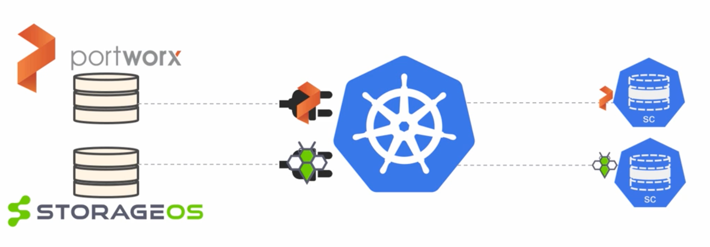

# Kubernetes Deep Dive

### Instructor<br>**Nigel Poulton**

<br>

### Course Outline

### Kubernetes Big Picture
- Section Overview
- Kubernetes Primer
- The Kubernetes API
- Kubernetes Objects
- Quick ways to get your own cluster

### Application Architecture
- Section Overview
- Theory
- Look at the sample app
- Section Recap

### Kubernetes Networking
- Section Overview
- Common Networking Requirements
- Sample App Requirements
- Kubernetes Networking Basics
- Kubernetes Service Fundamentals
- Service Types
- The Service Network
- Demo
- Section Recap

### Kubernetes Storage
- Section Intro
- Kubernetes Storage Big Picture
- The Container Storage Interface
- Persistent Volumes and Persistent Volume Claims
- Storage Classes
- Demo
- Section Recap

### From Code to Kubernetes
- Section Intro
- Big Picture
- Demo
- Section Recap

### Kubernetes Deployments
- Section Intro
- Theory of Deployments
- Demo
- Recap

### Scaling Applications Automatically
- Section Intro
- Big Picture
- Horizontal Pod Autoscaler Theory
- Horizontal Pod Autoscaler Demo
- Cluster Autoscaler Theory
- Cluster Autoscaler Demo
- Section Recap

### RBAC and Admission Control
- Section Intro
- Big Picture
- Authentication
- Authorization
- Admission Control
- Demo
- Recap

### Other Kubernetes Stuff
- Other Kubernetes Stuff

<br><br>

## Installation
### Private PC
- Minicube
- Docker for Desktop

### Cloud providers
- AKS (hosted)
- GKS (hosted)
- EKS (hosted)
- Kops

### On-prem
- Kubeadm

### Web practice 
- Play With Kubernetes (PWK)
  - http://play-with-k8s.com
  - 4 hours playground
  

# Notes


## Kubernetes Networking

- Kubernetes Networking Basics

  Core Rules:
  - All Nodes can talk
  - All Pods can talk (No NAT) with the use of `CNI plugin`
  - Every Pod gets its own IP

  **How it works:**

  Nodes get allocated a IP range to operate with (i.e Node1: 10.0.1.0/24, Node2: 10.0.2.0/24)
  Whenever the deployment is triggered,, K8s will allocate pods to a Node, and an IP address from the range tha belongs to the Node will be allocated to the Pod (i.e Node1-Pod1: 10.0.1.1, Node2-Pod2: 10.0.2.19)

  The Ip allocate to the node is available to all other Nodes and Pods for communication. Pod is also selfaware of its own IP address. 

- Kubernetes Service Fundamentals

  Services are stable abstraction point for pods. We create service and logically put it in front of the pods. So all other services instead of communication with Pods (whos IP regularlly change due to Pods crashin, scaling up/down, etc).

  **How it works:**

  Frontend:

  - Every service gets a name (i.e. `search-api`) and IP (i.e. `172.11.240.5`). Those two values are stable, and remain reserved for the service. The name and IP get registered with cluster's native DNS. Every pod knows how to use the core DNS and resolve the name to the address (Note: you might have to enable DNS).

  Backend:
  - On the backend (communication service to pods) it reolves the traffic destination by **lables**. 
  

  - When you create a service for the lable selector, K8s also creates another object on the cluster called `Endpoint Object`. It contains the list of Pod IPs and ports that match the service lable selector. 
  The Endpoint Object always has the same name as the service object it is associated with. And it maintains the list of all pods service can send requests to.
  

- Service Types

  There are several types of services in Kubernetes:

  - **ClusterIP (default)** 
  
    This is the default type of service. It exposes the Service on a cluster-internal IP. This means the service is only reachable from within the cluster.

    - Gets own IP
    - Only accessible from within cluster

  - **NodePort**
  
    This type of service exposes the Service on each Node's IP at a static port. A client can connect to the NodePort service from outside the cluster by using the Node's IP address and the static port number.

    - Gets cluster-wide port
    - Also accessible from outside of cluster
    - Default range for port selection 30000-32767. You can change this range with `--service-node-port-range` or hadcode desired port number in service description. 
    - Can be of TCP (default) or UDP
  
    ```yaml
    apiVersion: v1
      kind: Service
      metadata:
        name: wordpress
        labels:
          app: wordpress
      spec:
        type: NodePort
        ports:
          - port: 80 # Port that the Pods are listening on
            nodePort: 30080 # Cluster-wide port that the service listens on
        selector:
          app: wordpress
    ```

    
    To access this service you would use combination of node IP (i.e. `192.168.50.1`) and port number (i.e. NodePort `3126`) : `192.168.50.1:3126`

  - **LoadBalancer**
  
    This service type automatically creates an external load balancer in a cloud environment (like AWS, GCP, Azure) and assigns a unique external IP to the service. It is suitable for scenarios where you want to expose your service to the internet.

    Extrnal load balancer is used as proxy to forward traffic to your K8s cluster, usually via NodePort, but K8s configured this automatically. 


  - **ExternalName**
  
    This type of service is used to give an external name (DNS name) to a service, rather than exposing it internally within the cluster. It redirects requests to the external name to a CNAME record.

- The Service Network

  When you create a service it gets static IP. This static IP is allocated from **service network** range:

  

  However, there a subtle differences between how usual network and k8s network operates. 

  Each Node in k8s cluster has a `kube-proxy`.

  Kube-proxy is a crucial component of a Kubernetes cluster responsible for managing network connectivity to Kubernetes services. It runs on each node in the cluster and maintains network rules to handle forwarding of traffic to the appropriate pods or services. Essentially, kube-proxy enables communication between different parts of your Kubernetes cluster.

    Here's what kube-proxy does:

    - **Service Proxy**
     
      Kube-proxy maintains network rules on each node to support service abstraction. It watches the Kubernetes API for changes to services and endpoints and updates the rules accordingly. This ensures that traffic to a service's ClusterIP, NodePort, or LoadBalancer is properly forwarded to the correct destination pods.
    
    - **Load Balancing**
    
      For services that require load balancing, kube-proxy distributes incoming requests across multiple pods that provide the service. This helps distribute the workload evenly and ensures high availability and scalability of applications.

    - **NodePort Handling**
    
      If a service is exposed using the NodePort type, kube-proxy ensures that each node in the cluster forwards traffic on the specified port to the appropriate pods, even if those pods are on different nodes.

    - **Cluster Networking**
    
      Kube-proxy plays a role in enabling communication between pods across nodes in the cluster by managing network routing and IP address assignment.

    <br><br>When one pod wants to communicate with another pod within the same Kubernetes cluster:

    - It typically sends the request to the IP address associated with the service.

    - The request is intercepted by kube-proxy, which manages service abstraction and routing.

    - Kube-proxy forwards the request to the appropriate pod based on the service's endpoint configuration.

    - DNS resolution might be involved, but it's handled internally by Kubernetes rather than relying directly on the node's DNS.

      


<br><br>


  **Kube-proxy modes**
  - **Kube-proxy IPTABLES Mode**
    - Default since Kubernetes 1.2
    - Doesn't scale well
    - Not really designed for load balancing
  - **Kube-proxy IPVS Mode**
    - Stable (GA) since Kubernetes 1.11
    - Uses Linux kernel IP Virtual Server
    - Native Layer-4 load balancer
    - Supports more algorithms

    - Note:
      Kube-proxy in IPVS mode does create dummy interfaces on the Service Network (usually called kube-ipvs®). Kube-proxy in IPTABLES mode does not.


## Kubernetes Storage

- Kubernetes Storage Big Picture

  **Kubernetes volumes** are all about decoupling storage from Pods. Without PVs all your data lives and dies with pod (crash, scaling up/down). 

  Storage in K8s is refered to as `Volumes`, but also known as LUNs, devices, shares, mounts, spaces, etc.

  Fundamental storage requirements
  - Speed
  - Replication
  - Resiliency
  - etc

  Storage in K8s is implemented via combination of third-party infrastructure(EBS, S3,etc) Container Storage Interface (CSI) and PV Subsystem (PV, PVC SC):

  

- The Container Storage Interface

  Previously the link between extrernal storage and PV Subsystem was a part of K8s core.

  CSI replaced this approach and is an open-standard implementation (https://github.com/container-storage-interface/spec). 

- Persistent Volumes and Persistent Volume Claims

  How it works:
  1. You have the cloud infrastructure storage (standard or SSD) that plugs into K8s cluster via CSI (Google GCEPersistentDisk plugin). 
  2. You then create a Persistent Volume (i.e. Size: 30GB, IOPS:60)
    
  3. Persistent Volume Claim (PVC) creates permission to consume PV.
  

  **Access Modes:**
  - **RWO (ReadWriteOnce)**

    Can be mounted as read-write by only one pod in the cluster.

  - **RWM (ReadWriteMany)**

    Can be mounted as read-write by many pod in the cluster.

  - **ROM (ReadOnlyMany)**

    Allow mutiple pods to read only.

  >**Note**
  > Not all volumes support all modes
  > A PV can only have one active PVC/AccessMode

  **Reclaim Policy:**
  
    This is what a claster does when a claim on the volume is releases:

  - Delete

    K8s will delete claim once it is releases. If supported, it will also delte it on the storage backend as well.

  - Retain (default)

    Keeps the volume and it's contents. If you would like to delete it, it is then a manual operation. 

  Requirements for successful configuration:

  - Areas highlighted in yellow have to match
  
  - The claim can be for less then a cpacity of PV, howver if you claim more then PV allows it will not bind. 

<br>

  **How this comes together in Pod configuration:**
  1. You configure `spec.volumes` with reference to claim created. 
  2. In `spec.containers.image` you create a `volumeMount` instruction that points to `spec.volumes` configuration.

      

<br>

- **Storage Classes**

  Storage classes enable dynamic provisioning of volumes.

  When you have a Storage Class defined in Kubernetes, you typically create a PersistentVolumeClaim (PVC) that references that Storage Class instead of creating PersistentVolumes (PVs) directly.

  

  Here's the typical workflow:

  

  1. **Define a Storage Class**<br>The cluster administrator defines one or more Storage Classes, each representing a set of storage provisioning properties, such as storage type, disk speed, access mode, etc. This is usually done once and can be tailored to different storage requirements.
  2. **Create a PersistentVolumeClaim (PVC)**<br>When an application needs persistent storage, the user or developer creates a PersistentVolumeClaim (PVC) and specifies the desired storage class in the PVC specification. The PVC describes the storage requirements (e.g., size, access mode) but doesn't specify a particular volume.
  3. **Dynamic Provisioning**<br>When the PVC is created, Kubernetes checks the defined Storage Class and dynamically provisions a suitable PersistentVolume (PV) based on the class's parameters if no available PV matches the claim. If a suitable PV already exists, it binds the claim to that PV.
  3. **Binding PVC to PV**<br>If dynamic provisioning occurs, Kubernetes binds the PVC to the dynamically provisioned PV. If a suitable PV already existed, it's simply bound to the PVC.

  By following this workflow, users can request storage resources using PVCs without needing to know the specifics of the underlying storage infrastructure. Kubernetes handles the dynamic provisioning and binding process, abstracting away the complexities of storage management. This approach makes storage management more flexible, scalable, and automated.


## From Code to Kubernetes

- Big Picture
  
  From the high level, code to K8s running service follow involes following steps:
  - A source code (application)
  - Containerizing application (i.e. Docker Image)
  - Creating K8s object to push container along side with additional services (based on requirements) to K8s cluster.

- **Demo**

  1. Prep application files
    - Create following file structure:
      ```
      code-k8s
      ├── views
      │   └── home.pug
      ├── Dockerfile
      ├── app.js
      ├── package.json
      ├── web-deploy.yml
      ├── web-lb.yml
      └── web-nodeport.yml
      ```
    - `view/home.pug`
      ```pug
      html
        head
          title='ACG loves K8S'
          link(rel='stylesheet', href='http://netdna.bootstrapcdn.com/bootstrap/3.1.1/css/bootstrap.min.css')
        body
          div.container
            div.jumbotron
              h1 A Cloud Guru loves Kubernetes!!!
              p
              p 
                a.btn.btn-primary(href="https://www.amazon.com/Kubernetes-Book-Nigel-Poulton/dp/1521823634/ref=sr_1_3?ie=UTF8&qid=1531240306&sr=8-3&keywords=nigel+poulton") The Kubernetes Book
              p
      ```

    - `app.js`
      ```js
      // Simple node.js web app for demonstrating containerizing apps
      // For quick demo purposes only (not properly maintained)
      'use strict';

      var express = require('express'),
          app = express();

      app.set('views', 'views');
      app.set('view engine', 'pug');

      app.get('/', function(req, res) {
          res.render('home.pug', {
        });
      });

      app.listen(8080);
      module.exports.getApp = app;
      ```
      - `package.json`
      ```json
      {
        "name": "container-web-test",
        "private": true,
        "version": "0.0.1",
        "description": "Demo app for Web container demonstrations",
        "main": "app.js",
        "author": "Nigel Poulton <nigelpoulton@hotmail.com>",
        "license": "Will be full of vulnerabilities!",
        "dependencies": {
          "express": "4.16.3",
          "pug": "2.0.3"
        }
      }
      ```

  2. Prepare containerization descriptor
    - `Dockerfile`
      ```yml
      FROM centos:centos7

      LABEL MAINTAINER=nigelpoulton@hotmail.com

      # Install Node etc...
      RUN yum -y update; yum clean all
      RUN yum -y install epel-release; yum clean all
      RUN yum -y install nodejs npm; yum clean all

      # Copy source code to /src in container
      COPY . /src

      # Install app and dependencies into /src in container
      RUN cd /src; npm install

      # Document the port the app listens on
      EXPOSE 8080

      # Run this command (starts the app) when the container starts
      CMD cd /src && node ./app.js
      ```

  3. **Containerize application**
      ```yaml
      docker build -t <your-dockerhub-username>/<your-image-name>:<tag> .
      docker login
      docker push <your-dockerhub-username>/<your-image-name>:<tag>
      ```

  4. Prepade K8s descriptors
  - Deployment `web-deploy.yml`

    ```yaml
    apiVersion: apps/v1
    kind: Deployment
    metadata:
      name: simple-web
      labels:
        customer: acg
    spec:
      selector:
        matchLabels:
          app: web
      replicas: 3
      strategy:
        type: RollingUpdate
      template:
        metadata:
          labels:
            app: web
        spec:
          containers:
          - image: <your-dockerhub-username>/<your-image-name>:<tag>
            name: web-ctr
            ports:
            - containerPort: 8080
    ```
    - LoadBalancer service `web-lb.yml`
      ```yaml
      apiVersion: v1
      kind: Service
      metadata:
        name: web-svc
        labels:
          app: web
      spec:
        type: LoadBalancer
        ports:
        - port: 80
          targetPort: 8080
        selector:
          app: web
      ```
    - NodePort service `web-nodeport.yml`
      ```yaml
      apiVersion: v1
      kind: Service
      metadata:
        name: web-nodeport
        labels:
          app: web
      spec:
        type: NodePort
        ports:
          - port: 8080 #Forward traffic to pod port 8080
            nodePort: 31000 #Listen to traffic on following port
        selector:
          app: web
      ```

  5. Deploy objects to K8s
    ```yaml
    kubectl apply -f ./web-deploy.yml
    kubectl get deploy --watch

    kubectl apply -f ./<Service_descriptor_name>
    ```
   > **Test**<br>
   > Test deployment by openning `localhost:31000` in the browser


- Section Recap


## Kubernetes Deployments
- Section Intro


- Theory of Deployments


- Demo


- Recap


## Scaling Applications Automatically
- Section Intro


- Big Picture


- Horizontal Pod Autoscaler

  Sample Horizontal Pod Autoscaler (hpa)

```yaml
apiVersion: autoscaling/v1
kind: HorizontalPodAutoscaler
metadata:
  name: acg-test
  namespace: acg
spec:
  scaleTargetRef:
    apiVersion: apps/v1
    kind: Deployment
    name: acg-deploy
  minReplicas: 1
  maxReplicas: 10
targetCPUUtilizationPercentage:50
```
```yaml
apiVersion: apps/v1
kind: Deployment
metadata:
  name: acg-deploy
spec:
  replicas: 2
  ...
    spec:
    containers:
    - image: nginx:1.12
      name: nginx
      resources:
        limits:
          cpu: 1
        requests:
          cpu: 0.2
```
- Cluster Autoscaler Theory

  Enabled from cloud provider. Navigate to settings and enable cluster autoscaler.


## RBAC and Admission Control
- Section Intro

  

  Note: <br>
  The authentication and authorization work on secure port, so you will have to disable insecure port (insctruction can be found on Kubernetes website) to prevent from unauthorized login.

  **RBAC**

  - Has been enabled in v1.6 
  - Deny-by-default, so you will have to configure it, since once you enable it, it will lock everything down.

- Big Picture


- Authentication


- Authorization


- Admission Control


- Demo


- Recap


## Other Kubernetes Stuff
- Other Kubernetes Stuff

