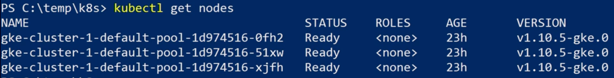
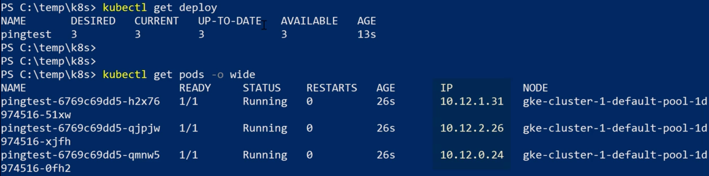
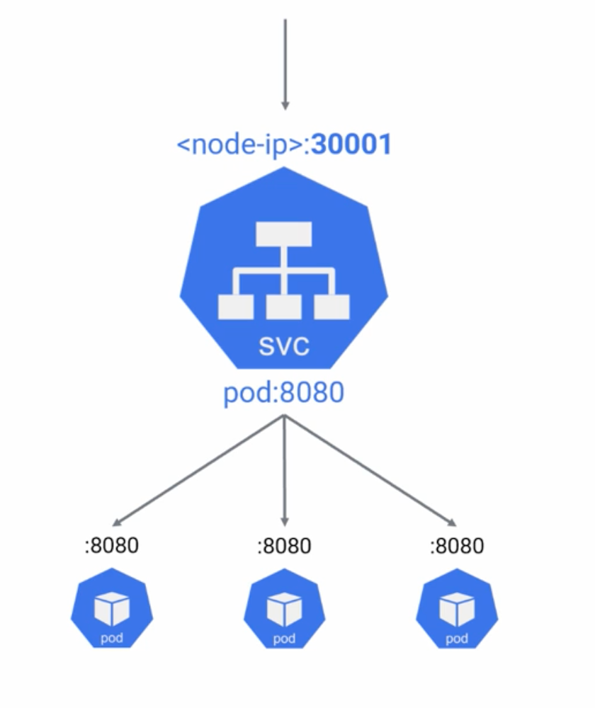
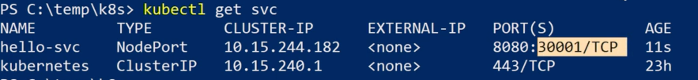
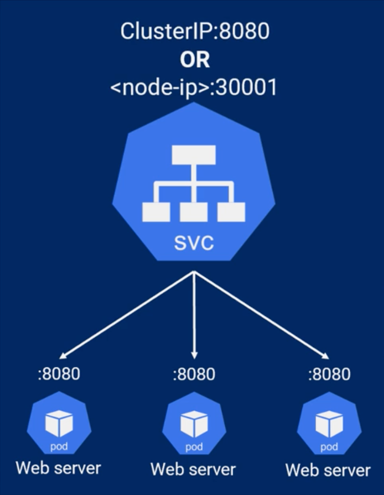
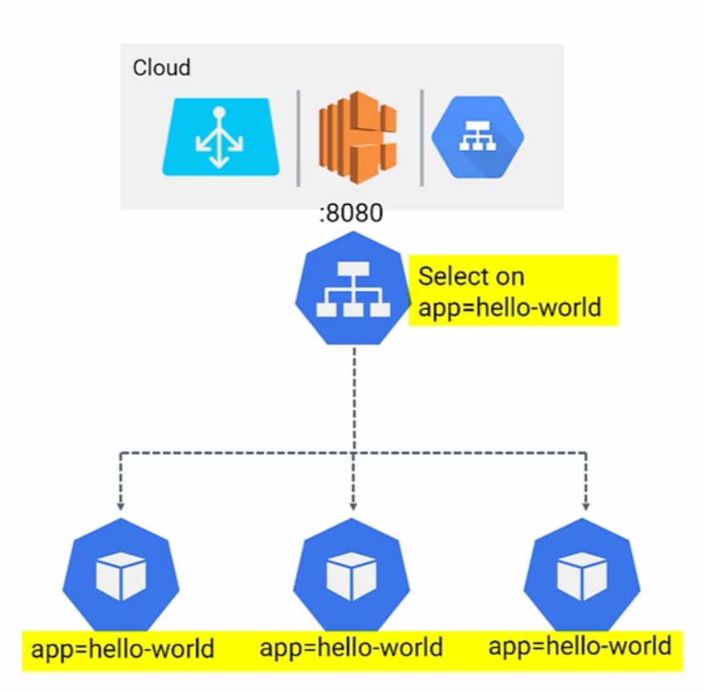

# Networking

1. Check nodes on cluster:
  `kubectl get nodes`

  

2. Create `ping-deploy.yml` descriptor:

```yaml
apiVersion: apps/v1
kind: Deployment
metadata:
  name: pingtest
  labels:
    app: pinger
spec:
  replicas: 3 I
  selector:
    matchLabels:
      app: pinger
  strategy:
    type: Recreate
  template:
    metadata:
      labels:
        app: pinger
    spec:
      containers:
      - image: ubuntu:latest
        name: ubuntu-ctr
        command:
          - /bin/bash
          - "-c"
          - "sleep 60m"
        imagePullPolicy: IfNotPresent
      restartPolicy: Always  
```

3. Apply deployment `kubectl apply -f ./ping-deploy.yml`
4. Check status of deployment
 
```sh
kubectl get deploy`
kubectl get pod -o wide
```



Each of nodes has been CIDR 24 applied to node:
  - Node1 10.12.0.0/24
  - Node2 10.12.1.0/24
  - Node3 10.12.2.0/24

Every node that will be deployed will get IP address from range available on the Node. 

5. Check nodes IPs: ```kubectl get nodes -o jsonpath=`{.items[*].spec.podCIDR}` ```

6. Test connectivity with other pods
```sh
# Login into pod
kubectl exec -it pingtest-6769c69dd5-h2x76 bash

# Install additional tools (ubuntu)
apt-get update
apt-get install iputils-ping curl dnsutils iproute2 -y

# Check IP address of the pod (inet: xxx)
ip a

# Pods should be able to talk, so you should be able to ping other two from section 4(10.12.1.31, 10.12.2.26)
ping 10.12.1.31
ping 10.12.2.26

exit
```

7. Create `simple-web.yml` with NodePort service

    

```yml
apiVersion: v1
kind: Service
metadata:
  name: hello-svc
  labels:
    app: hello-world
spec:
  type: NodePort
  ports:
  - port: 8080
    nodePort: 30001
    protocol: TCP
  selector:
    app: hello-world
---
apiVersion: apps/v1
kind: Deployment
metadata:
  name: hello-deploy
spec:
  replicas: 10
  selector:
    matchLabels:
      app: hello-world
  minReadySeconds: 10
  strategy:
    type: RollingUpdate
    rollingUpdate:
      maxUnavailable: 1
      maxSurge: 1
  template:
    metadata:
      labels:
        app: hello-world
    spec:
      containers:
      - name: hello-pod
        image: nigelpoulton/acg-web:0.1
        ports:
        - containerPort: 8080
```

8. Apply deployment
   
  `kubectl apply -f ./simple-web.yml`

9. Verify service creation

  `kubectl get svc`

  

10. You should be able to access the pod via two different methods:
    1.  `<CLUSTER-IP>:8080` 10.15.244.182:8080
    2.  `<Any-NODE-IP>:30001`


      

11. Login into pod and execute following commands

```sh
kubectl exec -it pingtest-6769c69dd5-h2x76 bash

# hello-svc will resolve to clusterIP
curl hello-svc:8080

# Find out public IP of the Node and use it to ping the service. Used in the lab:
curl 10.166.0.2:30001

# Check details of service
kubectl describe srv hello-srv
```

12. Create LoadBalancer service descriptor `lb.yml`

```yml
apiVersion: v1
kind: Service
metadata:
  name: lb-svc
  labels:
    app: hello-world
spec:
  type: LoadBalancer
  ports:
  - port: 8080
  selector:
    app: hello-world
```



13. Apply load balancer

  `kubectl apply -f ./lb.yml`

14. It might take 1-2 minutes to create LB. Check the status with following command:

  `kubectl get svc --watch`

  

15. Once the LB is provisioned copy the `EXTERNAL-IP` value for LB service and use it in the browser.

  `<EXTERNAL-IP>:8080`
