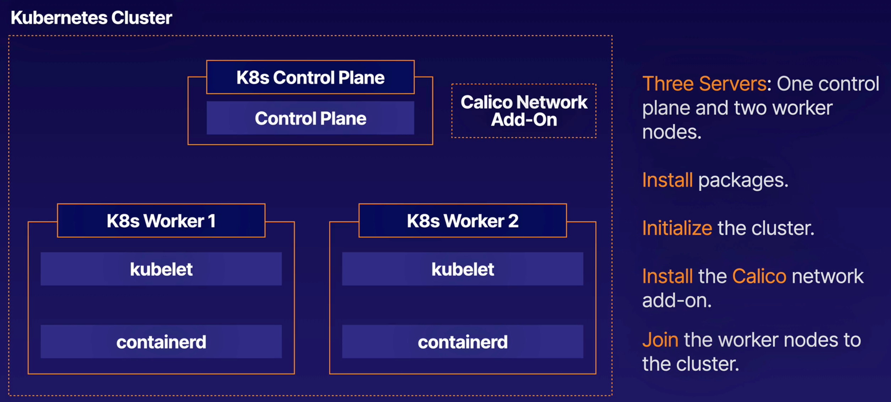

# Learn Kubernetes By Doing

### Course Outline

<br>

**Kubernetes Cluster Basics**
- Building a Kubernetes 1.27 Cluster with kubeadm
- Deploying a Simple Service to Kubernetes
- Deploying a Microservice Application to Kubernetes
- Creating a Kubernetes Cluster

<br>

**Working with Kubernetes Clusters**
- Deploying a Pod to a Node with a Label in Kubernetes
- Installing and Testing the Components of a Kubernetes Cluster

<br>

**Service Discovery, Scheduling and Lifecycle Management**
- Creating a Service and Discovering DNS Names in Kubernetes
- Scheduling Pods with Taints and Tolerations in Kubernetes
- Performing a Rolling Update of an Application in Kubernetes

<br>

**Storage and Security**
- Creating Persistent Storage for Pods in Kubernetes
- Creating a ClusterRole to Access a PV in Kubernetes

<br>

**Testing Your Cluster**
- Smoke Testing a Kubernetes Cluster
- Upgrading the Kubernetes Cluster Using kubeadm
- Logging and Monitoring
- Monitor and Output Logs to a File in Kubernetes
- Configuring Prometheus to Use Service Discovery
- Creating Alerting Rules

<br>

**Troubleshooting and Repairing Your Cluster**
- Repairing Failed Pods in Kubernetes

<br>

**Doing Things "The Hard Way"**
- Creating a Certificate Authority and TLS Certificates for Kubernetes
- Generating Kubeconfigs for a New Kubernetes Cluster
- Generating a Data Encryption Config for Kubernetes
- Bootstrapping Kubernetes Worker Nodes
- Bootstrapping a Kubernetes Control Plane
- Bootstrapping an etcd Cluster for Kubernetes
- Setting Up Kubernetes Networking with Weave Net


<br><br><br>

## Building a Kubernetes 1.27 Cluster with kubeadm

#### ABOUT THIS LAB
This lab will allow you to practice the process of building a new Kubernetes cluster. You will be given a set of Linux servers, and you will have the opportunity to turn these servers into a functioning Kubernetes cluster. This will help you build the skills necessary to create your own Kubernetes clusters in the real world.

<br>



#### Solution

### Install Packages

- Log in to the control plane node.

    > Note: The following steps must be performed on all three nodes.

- Create the configuration file for containerd:
    ```bash
    cat <<EOF | sudo tee /etc/modules-load.d/containerd.conf
    overlay
    br_netfilter
    EOF
    ```
- Load the modules:
    ```bash
    sudo modprobe overlay
    sudo modprobe br_netfilter
    ```
- Set the system configurations for Kubernetes networking:
    ```bash
    cat <<EOF | sudo tee /etc/sysctl.d/99-kubernetes-cri.conf
    net.bridge.bridge-nf-call-iptables = 1
    net.ipv4.ip_forward = 1
    net.bridge.bridge-nf-call-ip6tables = 1
    EOF
    ```
- Apply the new settings:
- 
    `sudo sysctl --system`

- Install containerd:

    `sudo apt-get update && sudo apt-get install -y containerd.io`

- Create the default configuration file for containerd:

    `sudo mkdir -p /etc/containerd`

- Generate the default containerd configuration, and save it to the newly created default file:

    `sudo containerd config default | sudo tee /etc/containerd/config.toml`

- Restart containerd to ensure the new configuration file is used:

    `sudo systemctl restart containerd`

- Verify that containerd is running:

    `sudo systemctl status containerd`

- Disable swap:

    `sudo swapoff -a`

- Install the dependency packages:

    `sudo apt-get update && sudo apt-get install -y apt-transport-https curl`

- Download and add the GPG key:

    `curl -fsSL https://pkgs.k8s.io/core:/stable:/v1.27/deb/Release.key | sudo gpg --dearmor -o /etc/apt/keyrings/kubernetes-apt-keyring.gpg`

- Add Kubernetes to the repository list:
    ```bash
    cat <<EOF | sudo tee /etc/apt/sources.list.d/kubernetes.list
    deb [signed-by=/etc/apt/keyrings/kubernetes-apt-keyring.gpg] https://pkgs.k8s.io/core:/stable:/v1.27/deb/ /
    EOF
    ```
- Update the package listings:

    `sudo apt-get update`

- Install Kubernetes packages:

    > Note: If you get a dpkg lock message, just wait a minute or two before trying the command again.

    sudo apt-get install -y kubelet kubeadm kubectl

- Turn off automatic updates:

    `sudo apt-mark hold kubelet kubeadm kubectl`

- Log in to both worker nodes to perform the previous steps.

<br>

#### Initialize the Cluster

- Initialize the Kubernetes cluster on the control plane node using kubeadm:

    `sudo kubeadm init --pod-network-cidr 192.168.0.0/16 --kubernetes-version 1.27.11`

- Set kubectl access:
    ```bash
    mkdir -p $HOME/.kube
    sudo cp -i /etc/kubernetes/admin.conf $HOME/.kube/config
    sudo chown $(id -u):$(id -g) $HOME/.kube/config
    ```

- Test access to the cluster:

    `kubectl get nodes`

<br>

#### Install the Calico Network Add-On

- On the control plane node, install Calico Networking:

    `kubectl apply -f https://raw.githubusercontent.com/projectcalico/calico/v3.25.0/manifests/calico.yaml`

- Check the status of the control plane node:

    `kubectl get nodes`

<br>

#### Join the Worker Nodes to the Cluster

- In the control plane node, create the token and copy the kubeadm join command:

    `kubeadm token create --print-join-command`

    > Note: This output will be used as the next command for the worker nodes.

- Copy the full output from the previous command used in the control plane node. This command starts with kubeadm join.

- In both worker nodes, paste the full `kubeadm join` command to join the cluster. Use `sudo` to run it as root:

    `sudo kubeadm join...`

- In the control plane node, view the cluster status:

    `kubectl get nodes`

    > Note: You may have to wait a few moments to allow all nodes to become ready.

<br><br><br>

## Deploying a Simple Service to Kubernetes

#### ABOUT THIS LAB

Deployments and services are at the core of what makes Kubernetes a great way to manage complex application infrastructures. In this hands-on lab, you will have an opportunity to get hands-on with a Kubernetes cluster and build a simple deployment, coupled with a service providing access to it. You will create a deployment and a service which can be accessed by other pods in the cluster.

#### Create a deployment for the store-products service with four replicas

- Log in to the Kube master node.

- Create the deployment with four replicas:

    ```yaml
    cat << EOF | kubectl apply -f -
    apiVersion: apps/v1
    kind: Deployment
    metadata:
    name: store-products
    labels:
        app: store-products
    spec:
    replicas: 4
    selector:
        matchLabels:
        app: store-products
    template:
        metadata:
        labels:
            app: store-products
        spec:
        containers:
        - name: store-products
            image: linuxacademycontent/store-products:1.0.0
            ports:
            - containerPort: 80
    EOF
    ```

<br>

#### Create a store-products service and verify that you can access it from the busybox testing pod

- Create a service for the store-products pods:
    ```yaml
    cat << EOF | kubectl apply -f -
    kind: Service
    apiVersion: v1
    metadata:
    name: store-products
    spec:
    selector:
        app: store-products
    ports:
    - protocol: TCP
        port: 80
        targetPort: 80
    EOF
    ```

- Make sure the service is up in the cluster:

    `kubectl get svc store-products`

  The output will look something like this:

  ```bash
  NAME             TYPE        CLUSTER-IP      EXTERNAL-IP   PORT(S)   AGE
  store-products   ClusterIP   10.104.11.230   <none>        80/TCP    59s
  ```
- Use `kubectl exec` to query the store-products service from the busybox testing pod.

    `kubectl exec busybox -- curl -s store-products`


<br><br><br>

## Deploying a Microservice Application to Kubernetes

#### Introduction
Microservice applications can be quite complex but that complexity can offer many benefits. Kubernetes can help you take advantage of those benefits by making these complex infrastructures easier to manage through automation. In this hands-on lab, you will see the value of Kubernetes firsthand as you deploy a complex microservice architecture to the cluster and then independently scale some of its components.

<br>

#### Deploy the Stan's Robot Shop app to the cluster

- Clone the Git repo that contains the pre-made descriptors:
    
    `cd ~/`
    `git clone https://github.com/linuxacademy/robot-shop.git`

- Since this application has many components, it is a good idea to create a separate namespace for the app:

    `kubectl create namespace robot-shop`

- Deploy the app to the cluster:

    `kubectl -n robot-shop create -f ~/robot-shop/K8s/descriptors/`

- Check the status of the application's pods:

    `kubectl get pods -n robot-shop`

- You should be able to reach the robot shop app from your browser using the Kube master node's public IP:

    `http://$kube_master_public_ip:30080`

<br>

#### Scale up the MongoDB deployment to two replicas instead of just one

- Edit the deployment descriptor:

    `kubectl edit deployment mongodb -n robot-shop`

- You should see some YAML describing the deployment object.

    - Under `spec:`, look for the line that says `replicas: 1` and change it to `replicas: 2`.
    - Save and exit.

- Check the status of the deployment with:

    `kubectl get deployment mongodb -n robot-shop`

- After a few moments, the number of available replicas should be 2.


<br><br><br>

## Creating a Kubernetes Cluster

#### ABOUT THIS LAB
In this hands-on lab, we will install and configure a Kubernetes cluster consisting of 1 master and 2 nodes. Once the installation and configuration are complete, we will have a 3-node Kubernetes cluster that uses Flannel as the network overlay.

<br>

#### Solution

#### Install Docker and Kubernetes on All Servers
Most of these commands need to be run on each of the nodes. Pay attention though. Down at Step 10, we are going to do a little bit on just the master, and down at Step 15 we'll run something on just the nodes. There are notes down there, just be watching for them.

1. Once we have logged in, we need to elevate privileges using sudo:

    `sudo su`

2. Disable SELinux:
    ```bash
    setenforce 0
    sed -i --follow-symlinks 's/SELINUX=enforcing/SELINUX=disabled/g' /etc/sysconfig/selinux
    ```

3. Enable the br_netfilter module for cluster communication:
    ```bash
    modprobe br_netfilter
    echo '1' > /proc/sys/net/bridge/bridge-nf-call-iptables
    ```

4. Ensure that the Docker dependencies are satisfied:

    `yum install -y yum-utils device-mapper-persistent-data lvm2`

5. Add the Docker repo and install Docker:
   
    ```bash
    yum-config-manager --add-repo https://download.docker.com/linux/centos/docker-ce.repo
    yum install -y docker-ce
    ```

6. Set the cgroup driver for Docker to systemd, reload systemd, then enable and start Docker:
   
    ```bash
    sed -i '/^ExecStart/ s/$/ --exec-opt native.cgroupdriver=systemd/' /usr/lib/systemd/system/docker.service
    systemctl daemon-reload
    systemctl enable docker --now
    ```

7. Add the Kubernetes repo:
    ```bash
    cat << EOF > /etc/yum.repos.d/kubernetes.repo
    [kubernetes]
    name=Kubernetes
    baseurl=https://packages.cloud.google.com/yum/repos/kubernetes-el7-x86_64
    enabled=1
    gpgcheck=0
    repo_gpgcheck=0
    gpgkey=https://packages.cloud.google.com/yum/doc/yum-key.gpg
      https://packages.cloud.google.com/yum/doc/rpm-package-key.gpg
    EOF
    ```
8. Install Kubernetes v1.14.0:

    `yum install -y kubelet-1.14.0-0 kubeadm-1.14.0-0 kubectl-1.14.0-0 kubernetes-cni-0.7.5`

9. Enable the kubelet service. The kubelet service will fail to start until the cluster is initialized, this is expected:

    `systemctl enable kubelet`

<br>

#### Note: Complete the following steps on the NODES ONLY!

10. Initialize the cluster using the IP range for Flannel:

    `kubeadm init --pod-network-cidr=10.244.0.0/16`

11. **Copy the** `kubeadmn join` **command that is in the output**. We will need this later.

12. Exit sudo, copy the admin.conf to your home directory, and take ownership.
    
    ```bash
    mkdir -p $HOME/.kube
    sudo cp -i /etc/kubernetes/admin.conf $HOME/.kube/config
    sudo chown $(id -u):$(id -g) $HOME/.kube/config
    ```

13. Deploy Flannel:
    
    ```bash
    kubectl apply -f https://raw.githubusercontent.com/flannel-io/flannel/master/Documentation/kube-flannel-old.yaml
    ```

14. Check the cluster state:

    `kubectl get pods --all-namespaces`

<br>

#### Note: Complete the following steps on the NODES ONLY!

15. Run the `join` command that you copied earlier, this requires running the command prefaced with `sudo` on the nodes (if we hadn't run `sudo su` to begin with). Then we'll check the nodes from the master.

    `kubectl get nodes`

<br>

#### Create and Scale a Deployment Using kubectl<br>Note: These commands will only be run on the master node.

16. Create a simple deployment:

    `kubectl create deployment nginx --image=nginx`
17. Inspect the pod:

    `kubectl get pods`

18. Scale the deployment:

    `kubectl scale deployment nginx --replicas=4`

19. Inspect the pods. We should have four now:

    `kubectl get pods`
    

<br><br><br><br>

## Working with Kubernetes Cluster

## Deploying a Pod to a Node with a Label in Kubernetes

### ABOUT THIS LAB

In this hands-on lab, you will need to create the pod YAML necessary to create a pod and assign that pod to a specific node with the label disk=ssd. First, find the node with that label, creat the YAML, then apply the YAML to the provided Kubernetes cluster. You will have completed this hands-on lab when you have verified that the pod is running successfully on the correct node.


- List all the nodes in the cluster.
    Use the following command to list the nodes in your cluster:

    `kubectl get nodes`

    We should see three nodes: one master and two workers.

- List all the pods in all namespaces.

    Use the following command to list the pods in all namespaces:

    `kubectl get pods --all-namespaces`

- List all the namespaces in the cluster.
    Use the following command to list all the namespaces in the cluster:

    `kubectl get namespaces`

    Here, we should see four namespaces: default, kube-public, kube-system, and kube-node-lease.

- Check to see if there are any pods running in the default namespace.
    Use the following command to list the pods in the default namespace:

    `kubectl get pods`

    We should see that there aren't any pods in the default namespace.

- Find the IP address of the API server running on the master node.
    Use the following command to find the IP address of the API server:

    `kubectl get pods --all-namespaces -o wide`

- List the labels for all nodes in the cluster
    Use the following command to list the labels for all nodes:

    `kubectl get no --show-labels`

    We should see the label disk=ssd for one of the nodes.


<br>

#### Create the pod YAML that will run on the node labeled disk=ssd

- Create a file named pod.yaml (vi pod.yaml) and paste in the following:

    ```yaml
    apiVersion: v1
    kind: Pod
    metadata:
    name: nginx
    spec:
    containers:
        - name: nginx
        image: nginx
    nodeSelector:
        disk: ssd
    ```

- Apply the YAML to the Kubernetes cluster with the following command:

    `kubectl apply -f pod.yaml`

<br>

#### Verify that the pod is running on the correct node
- Verify that pod is on correct node with the following command

    `kubectl get pod -o wide`

    You should see the node with the label in the node column


<br><br><br>

## Installing and Testing the Components of a Kubernetes Cluster

### ABOUT THIS LAB
In this lab, you will build a cluster from scratch, as well as test the components of the cluster (including the deployments, pods, port forwarding, and services) and execute a command from within a pod. In order to build the Kubernetes cluster, we need to install the container runtime, as well as kubeadm, kubectl, and kubelet. We will then initialize the cluster, add our CNI, and add the nodes to the cluster.

<br>

#### Get the Docker gpg, and add it to your repository.

- In all three terminals, run the following command to get the Docker gpg key:

    `curl -fsSL https://download.docker.com/linux/ubuntu/gpg | sudo apt-key add -`

- Then add it to your repository:

    `sudo add-apt-repository "deb [arch=amd64] https://download.docker.com/linux/ubuntu $(lsb_release -cs) stable"`

<br>

#### Get the Kubernetes gpg key, and add it to your repository.

- In all three terminals, run the following command to get the Kubernetes gpg key:

    `curl -s https://packages.cloud.google.com/apt/doc/apt-key.gpg | sudo apt-key add -`

- Then add it to your repository:
  
    ```shell
    cat << EOF | sudo tee /etc/apt/sources.list.d/kubernetes.list
    deb https://apt.kubernetes.io/ kubernetes-xenial main
    EOF
    ```

- Update the packages:

    `sudo apt update`


> After completing these steps, your system is configured to install Kubernetes packages using the apt package manager. Now, you can proceed with installing Kubernetes components on your system.

<br>

#### Install Docker, kubelet, kubeadm, and kubectl.

- In all three terminals, run the following command to install Docker, kubelet, kubeadm, and kubectl:

    `sudo apt install -y docker-ce=5:19.03.10~3-0~ubuntu-focal kubelet=1.18.5-00 kubeadm=1.18.5-00 kubectl=1.18.5-00`

<br>

#### Initialize the Kubernetes cluster.

- In the Controller server terminal, run the following command to initialize the cluster using kubeadm:

    `sudo kubeadm init --pod-network-cidr=10.244.0.0/16`

<br>

#### Set up local kubeconfig.
- In the Controller server terminal, run the following commands to set up local kubeconfig:

    ```bash
    sudo mkdir -p $HOME/.kube
    sudo cp -i /etc/kubernetes/admin.conf $HOME/.kube/config
    sudo chown $(id -u):$(id -g) $HOME/.kube/config
    ```

#### Apply the flannel CNI plugin as a network overlay.

- In the Controller server terminal, run the following command to apply flannel:

     `kubectl apply -f https://docs.projectcalico.org/v3.14/manifests/calico.yaml`

<br>

#### Join the worker nodes to the cluster, and verify they have joined successfully.

- When we ran `sudo kubeadm init` on the Controller node, there was a `kubeadmin join` command in the output. You'll see it right under this text:

    > You can now join any number of machines by running the following on each node as root:

- To join worker nodes to the cluster, we need to run that command, as root (we'll just preface it with sudo) on each of them. It should look something like this:

    `sudo kubeadm join <your unique string from the output of kubeadm init>`

<br>

#### Run a deployment that includes at least one pod, and verify it was successful.

- In the Controller server terminal, run the following command to run a deployment of ngnix:

    `kubectl create deployment nginx --image=nginx`

- Verify its success:

    `kubectl get deployments`

####  Verify the pod is running and available.

- In the Controller server terminal, run the following command to verify the pod is up and running:

    `kubectl get pods`

<br>

#### Use port forwarding to extend port 80 to 8081, and verify access to the pod directly.

- In the Controller server terminal, run the following command to forward the container port 80 to 8081 (replace <pod_name> with the name in the output from the previous command):

    `kubectl port-forward <pod_name> 8081:80`

- Open a new terminal session and log in to the Controller server. Then, run this command to verify we can access this container directly:

    `curl -I http://127.0.0.1:8081`

    > We should see a status of OK.

